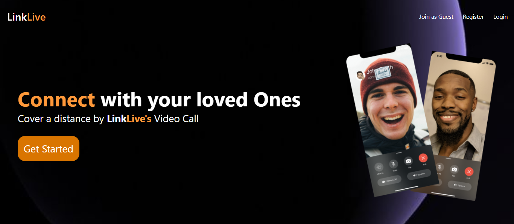
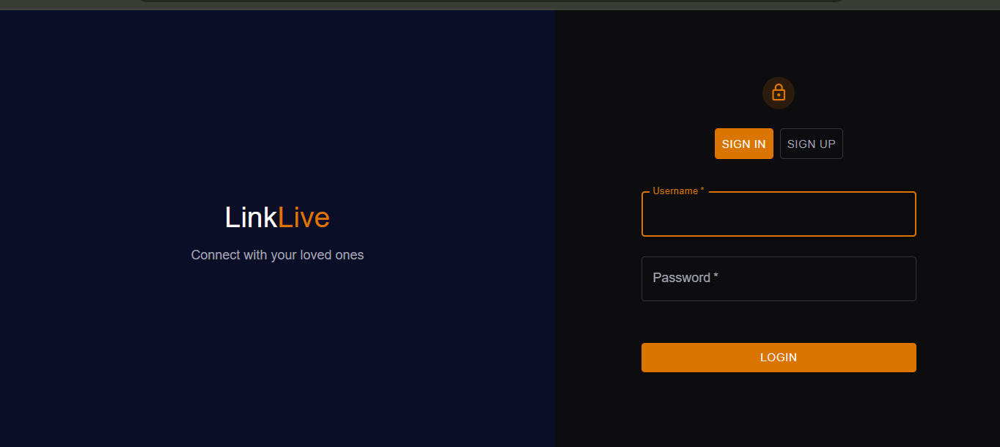
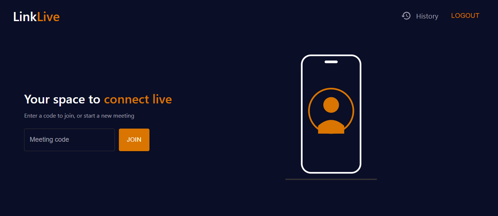
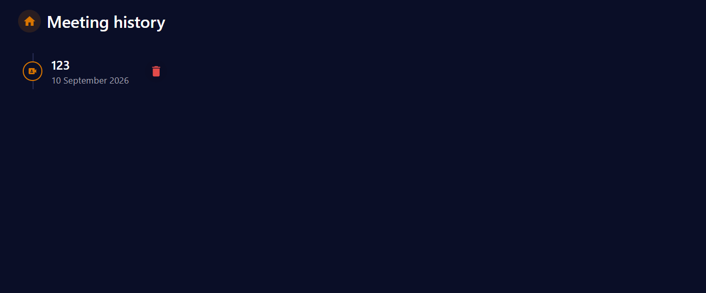

# LinkLive

A Zoom-inspired video conferencing web app built with the MERN stack, WebRTC, and Socket.io — supporting real-time video/audio calls, in-call chat, and meeting history.

🔗 **Live Demo:** https://link-live-cv7e-vert.vercel.app
🐳 Docker Hub:

Backend: https://hub.docker.com/r/nitya28/linklive-backend
Frontend: https://hub.docker.com/r/nitya28/linklive-frontend

## 📸 Screenshots

### Landing Page



### Authentication Page



### Home Page



### In-Call Screen


### Meeting History Page



## ✨ Features

- **User authentication** — sign up and log in with username/password
- **Instant meetings** — create or join a meeting using a unique meeting code
- **Real-time video & audio calls** — peer-to-peer connections powered by WebRTC
- **In-call controls** — toggle camera, microphone, and screen sharing
- **Live chat** — send and receive messages during a call in real time via Socket.io
- **Meeting history** — automatically logs meetings you've joined, with the ability to delete individual entries
- **Responsive UI** — fully responsive dark-themed interface, usable on both desktop and mobile
- **Containerized** — fully Dockerized with a multi-stage frontend build (Vite → nginx) and a separate backend image, orchestrated via Docker Compose

## 🛠️ Tech Stack

**Frontend**

- React
- Material UI (MUI)
- React Router
- Socket.io-client
- Axios

**Backend**

- Node.js
- Express
- MongoDB with Mongoose
- Socket.io
- WebRTC (RTCPeerConnection) for peer-to-peer media streaming

**DevOps**

- Docker (multi-stage builds)
- Docker Compose
- nginx (serving the production frontend build)

## ⚙️ Getting Started

You can run LinkLive either locally with Node.js or with Docker.

### Option 1: Run with Docker

## Prerequisites:

Docker and Docker Compose installed, and a MongoDB Atlas connection string.

Clone the repository:

```bash
git clone https://github.com/Nitya-Rathod/LinkLive.git
cd LinkLive
```

Create a .env file inside the backend folder:

```env
MONGO_URI=your_mongodb_connection_string
PORT=8000
```

**Build and start both containers:**

```bash
docker-compose up --build
```

- Frontend: http://localhost:5173
- Backend: http://localhost:8000

**To stop the containers:**

```bash
docker-compose down
```

Or pull the pre-built images directly from Docker Hub without cloning the repo:

```bash
docker pull yourusername/linklive-backend:latest
docker pull yourusername/linklive-frontend:latest
Option 2: Run locally with Node.js
```

Prerequisites

- Node.js installed
- MongoDB instance (local or hosted, e.g. MongoDB Atlas)

**Backend setup**

```bash
cd backend
npm install
```

Create a .env file in the backend folder with:

```env
MONGO_URI=your_mongodb_connection_string
PORT=8000
```

Start the backend server:

```bash
npm start
```

**Frontend setup**

```bash
cd frontend
npm install
npm run dev
```

The app will be available at http://localhost:5173.

## How It Works

1. Sign up or log in to your account (or join as a guest).
2. Create a new meeting or enter an existing meeting code to join.
3. Enter the lobby to preview your camera before joining.
4. Once connected, use the in-call controls to manage video, audio, screen sharing, and chat.
5. Past meetings are saved to your history and can be viewed or deleted anytime.

## 📂 Project Structure

```
linklive/
├── frontend/                # React application
│   ├── src/
│   │   ├── pages/            # Landing, Auth, Home, History, VideoMeet
│   │   ├── contexts/          # AuthContext (auth + history API calls)
│   │   ├── styles/            # Page-specific CSS
│   │   └── utils/             # Route protection (withAuth)
│   ├── Dockerfile             # Multi-stage build: Vite build → nginx
│   └── .dockerignore
├── backend/                 # Express + MongoDB API
│   ├── controllers/
│   ├── models/                # User, Meeting
│   ├── routes/
│   ├── sockets/               # Socket.io signaling logic
│   ├── Dockerfile
│   └── .dockerignore
└── docker-compose.yaml       # Orchestrates frontend + backend containers
```

## Known Limitations

Backend is hosted on Render's free tier, which spins down after periods of inactivity — the first request after idle time may take 30–60 seconds
Video/audio quality depends on network conditions, as with any WebRTC-based peer-to-peer app

## 📄 License

This project is created for educational and portfolio purposes.
